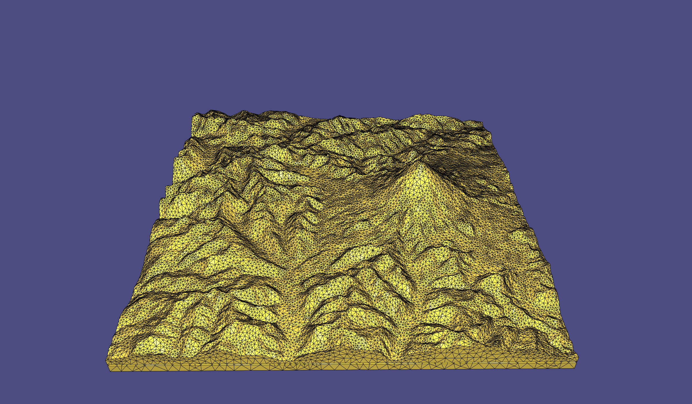
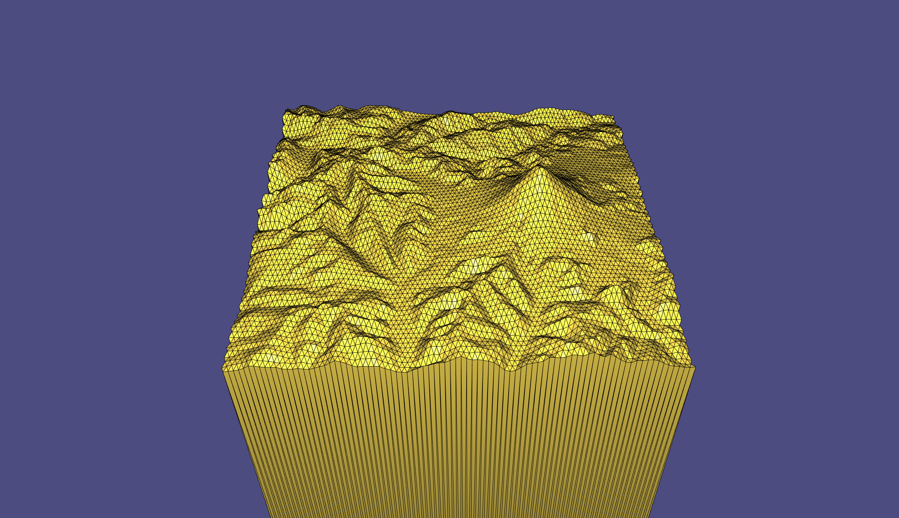
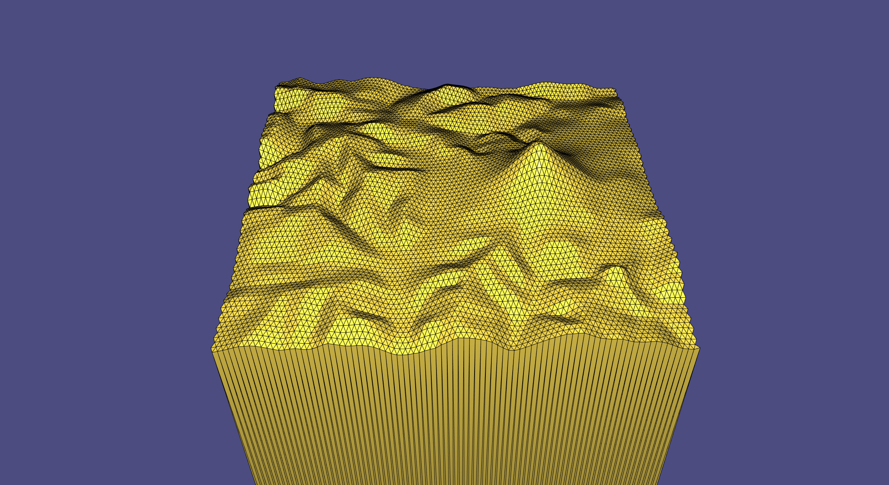

# Developability of Heightfields via Rank Minimization

This is an implementation of the core functionality of "Developability of Heightfields via Rank Minimization" by Sellán et al. 2020.

## Compile

Compile this project using the standard cmake routine:

    mkdir build
    cd build
    cmake -DCMAKE_BUILD_TYPE=Release ../ 
    make

This will create a `example_bin` binary. A pre-compiled MacOS binary is also provided here.

## Run

From within the main directory just issue:

    ./main

A viewer app should launch showing a 3D mesh of a mountain range, and instructions should appear on the console.

You can begin by hitting H in your keyboard to convert this 3D mesh into a heightfield, which will appear on screen.

Now, you can further hit S to get the closest developable heightfield (this can take around a minute). 

You are not limited to our sample. In general, you can run our code as

    ./main -i input_shape.obj -n grid_size

and follow the same instructions.

